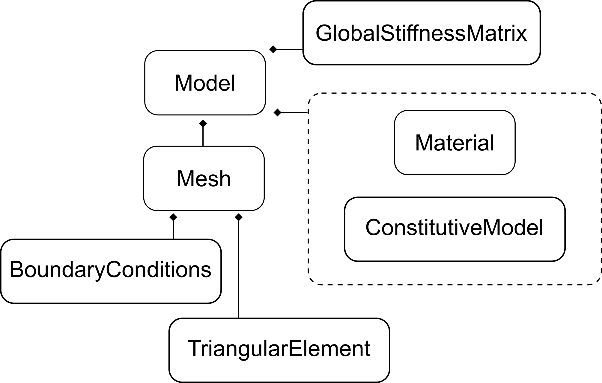

#  SimpleFEA

`SimpleFEA` is an extremely simple 2D Finite Element Analysis package written in Python. Designed primarily for the purposes of education, and for exploring simple proof of concept ideas, such as constructing surrogate models.

## Code structure

- Look at using the builder design pattern

## Examples

| # | Description | Solution |
|---|-------------|----------|
| 1 | 2D plate in tension | |
| 2 | Using Gaussian process regression to build a surrogate model | |