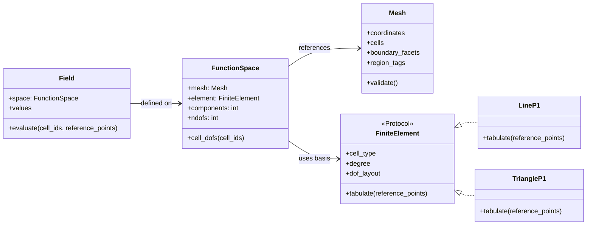
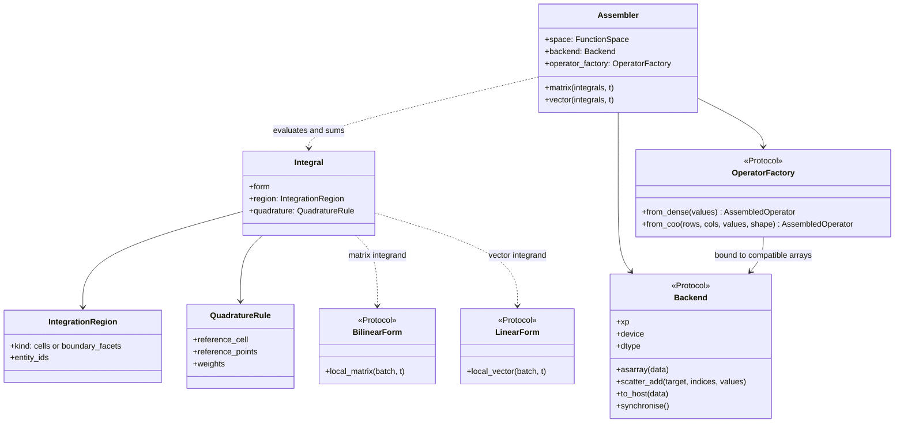
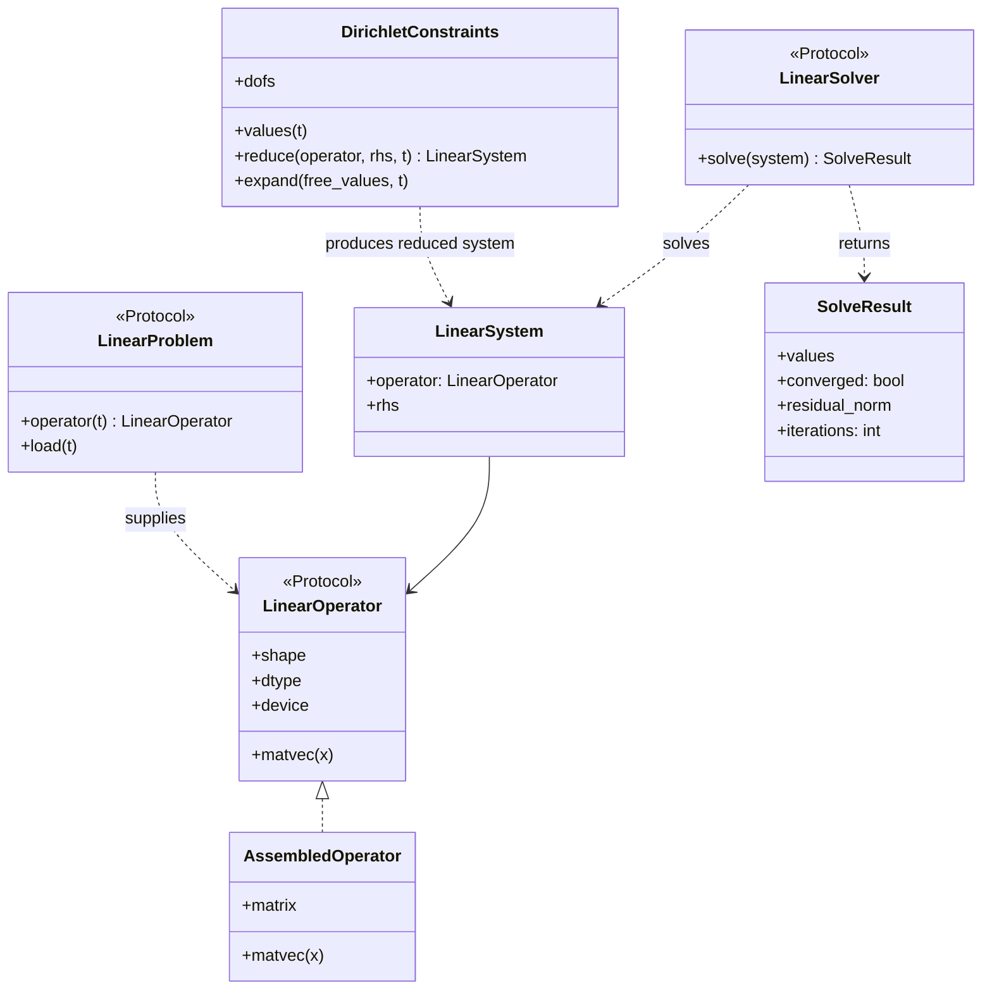
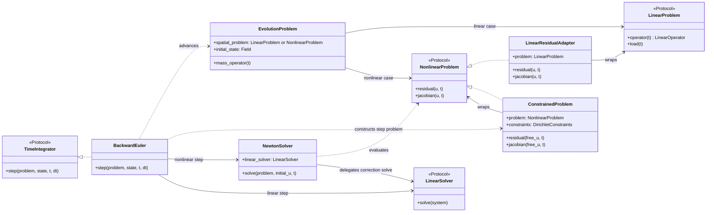

# SimpleFEA teaching and development roadmap

## Purpose

Teach the finite element method (FEM) from its mathematical formulation through working solvers, then use those solvers to explain when and how GPU acceleration helps. Each notebook should introduce one main idea, produce a result that can be checked, and call reusable code from `simplefea` once the idea has been derived.

The recurring progression is **formulation → discretisation → assembly → solution → verification → performance**. Start with a small CPU implementation that is easy to inspect. Add sparse and GPU implementations only after they can be compared with a trusted result.

### Long-term teaching goal

Through a series of examples, demonstrate how to solve increasingly demanding PDEs:

1. **Linear, steady PDEs**, beginning with the scalar Poisson equation. Use it to teach weak forms, scalar function spaces, source terms and boundary integrals. The current 1D bar and 2D linear elasticity examples provide related linear problems; Poisson is a scalar bridge between them.
2. **Time-dependent PDEs**, beginning with the heat equation. Introduce the mass matrix, initial conditions, time integration and separate spatial and temporal convergence checks.
3. **Nonlinear PDEs**, beginning with a scalar nonlinear diffusion problem. Introduce residuals, consistent Jacobians, Newton iteration and nonlinear convergence checks.
4. **Systems of time-dependent nonlinear PDEs**, using a coupled reaction–diffusion example. Introduce multiple fields, coupling, block structure and the interaction between nonlinear and time-step solvers.

These are curriculum milestones, not features to build into a general-purpose PDE framework immediately. Reuse the mesh, function-space and assembly ideas as each example requires them; keep equation-specific forms and solvers explicit enough for a learner to follow.

## Initial notebook sequence: FEM and GPU foundations

| No. | Notebook | Concepts and exercise | Checkable result |
| --- | --- | --- | --- |
| 01 | Weak form and function spaces | Derive the 1D bar weak form. Introduce admissible displacement and test spaces, essential and natural boundary conditions, and the intuitive meaning of \(H^1\). | Compare with the analytical bar solution. |
| 02 | Discrete spaces and shape functions | Construct the piecewise linear finite-dimensional space \(V_h\). Plot nodal hat functions; derive the two-node reference element, mapping, Jacobian and quadrature. | Verify partition of unity and exact reproduction of a linear field. |
| 03 | Degrees of freedom and assembly | Write \(u_h\) as a sum of basis functions. Map local to global degrees of freedom and assemble the 1D system. Introduce a small `FunctionSpace` abstraction here. | Compare assembled entries with a hand calculation and show the sparsity pattern. |
| 04 | Loads, constraints and reactions | Apply nodal forces and prescribed displacements, including nonzero values. Solve and recover support reactions from the original system. | Verify force balance and the analytical displacement. |
| 05 | Poisson equation on triangles | Derive the scalar 2D weak form, triangular basis gradients, source and boundary terms, then solve on a small mesh. | Compare with a manufactured or analytical solution. |
| 06 | Vector-valued 2D elasticity | Extend the function space to two displacement components per node. Derive the constant-strain triangle, its \(B\) matrix and stiffness; distinguish plane stress from plane strain. | Run a constant-strain patch test. |
| 07 | A 2D plate | Compose mesh, material, elements, loads, constraints and solver for a deliberately small plate with fixed dimensions and consistently integrated boundary traction. Plot displacement and element stress. | Check the applied resultant and reactions, then compare displacement with a refined mesh or another reference. |
| 08 | Verification and convergence | Refine Poisson and elasticity meshes while keeping the domain, coefficients and physical loading fixed. Examine error and explain the limits of the chosen elements. | Verify refinement invariance, then report error norms and observed convergence rates alongside patch tests. |
| 09 | Sparse systems and iterative solvers | Replace dense global storage with sparse assembly. Examine memory, conditioning, direct and iterative solves. | Match the small dense solution and measure memory growth. |
| 10 | CPU performance baseline | Profile element calculations, assembly and solution across mesh sizes. Establish which stage dominates before accelerating it. | Report time and memory by stage and problem size. |
| 11 | GPU element calculations and assembly | Batch independent element calculations; compare global assembly approaches, including a matrix-free operator if useful. Account for transfers between host and device. | Match the CPU element and operator results within a stated tolerance. |
| 12 | GPU solution and performance | Solve the same problem on CPU and GPU. Study precision, solver convergence, transfer cost and the size at which acceleration becomes useful. | Present accuracy, total time and memory across several mesh sizes. |

## Later PDE examples

These modules extend the same concepts after the initial sequence is reliable. Their examples and numerical methods should be selected to keep each new difficulty visible.

| No. | Example | New idea | Checkable result |
| --- | --- | --- | --- |
| 13 | Heat equation | Add a mass matrix and time integrator to the spatial FEM operator; compare explicit and implicit steps where suitable. | Check against an analytical transient solution and separate time-step from mesh error. |
| 14 | Nonlinear diffusion | Form a residual and consistent Jacobian; solve with Newton iteration. | Check the Jacobian against a finite-difference directional derivative, verify nonlinear convergence, and measure solution error and refinement rates against a manufactured or analytical solution. |
| 15 | Coupled reaction–diffusion system | Use multiple fields with nonlinear coupling and time dependence; examine block operators and solver choices. | Check a simplified limiting case, conservation or bounds where applicable, and refinement behaviour. |

### Where function spaces fit

Introduce them twice, at different levels of detail:

1. **Notebook 01:** The weak form needs a space of admissible displacements and a space of test functions. For a bar fixed at the left end, the test functions vanish there. Explain \(H^1\) through square-integrable displacement and first weak derivative; in this 1D setting its functions have continuous representatives. Detailed functional analysis is outside this introductory sequence. For nonzero prescribed displacement, distinguish the affine trial space from the zero-valued test space.
2. **Notebook 02:** Restrict those spaces to continuous, piecewise linear functions on a mesh. The nodal hat functions make \(V_h\) and its degrees of freedom visible. Their restrictions to one element are the reference-element shape functions.
3. **Notebooks 03, 05 and 06:** Use the function space to explain local-to-global degree-of-freedom maps, extend it to a scalar field on triangles, then revisit it for vector-valued 2D displacement. This gives a mathematical reason for two unknowns per node and the form of the \(B\) matrix.

The first two notebooks should show the mathematics explicitly. Introduce a `FunctionSpace` object when assembly needs a reusable degree-of-freedom map, rather than starting with an abstraction students have not yet motivated.

### Verification requirements

Before a refinement study, verify that every mesh represents the same physical domain, material coefficients, boundary regions and loading. Mesh generators must preserve the specified endpoints and dimensions. Integrate a prescribed traction over the boundary using the basis functions and facet quadrature; for a specified total force, distribute it consistently and verify its resultant. A fixed force at each boundary node changes the problem as nodes are added. Check force and moment resultants where applicable, then check the corresponding support reactions.

For problems with a known solution, specify the error norms and expected rates for the chosen element and solution regularity. For scalar diffusion examples, report the spatial \(L^2\) error and \(H^1\) seminorm error, evaluated by quadrature, and calculate observed rates across successive meshes. Use a smooth reference problem for the convergence demonstration; discuss corner or load singularities separately. Choose quadrature accuracy and linear/nonlinear solver tolerances so they do not dominate the discretisation error.

The nonlinear diffusion notebook must include a manufactured or analytical solution whose source and boundary data are derived independently from the implemented residual. A directional-derivative check establishes that the Jacobian differentiates that residual; a small residual establishes that the discrete equations were solved. The independent solution and mesh-refinement checks establish whether those equations approximate the intended PDE. For transient examples, check spatial and temporal error separately.

## Code structure to support the notebooks

Use classes for objects with a clear identity, state or interchangeable behaviour. Use small functions for numerical kernels. Keep notebook cells explicit about which operation is being performed: constructing a mesh, assembling an operator, applying constraints or solving a system.

Prefer composition and small Python protocols at extension boundaries. Data containers can be dataclasses; a new implementation should satisfy the required interface without inheriting a large framework base class. Constructors validate and store configuration. Assembly, solution and plotting happen through explicit calls.

### Target architecture: mesh, approximation and fields

`Mesh` stores geometry and topology. `FiniteElement` describes a reference basis. `FunctionSpace` combines a mesh and element with a component count and degree-of-freedom map. `Field` pairs that space with coefficient values. The mesh can therefore support displacement, temperature and other fields without owning their material laws or solutions.

These are class diagrams: solid arrows indicate references, dotted arrows indicate dependencies, and hollow triangular arrows indicate protocol implementations. Method signatures describe the intended contracts; they are not a commitment to a particular array library.

One reference-element object is shared across cells of the same type. Coordinates, connectivity and field coefficients remain arrays; avoid an object containing stiffness and material state for every cell. `tabulate` returns reference basis values and derivatives. Separate geometry kernels compute Jacobians and transform derivatives into physical coordinates, validating cell orientation and degeneracy.

The first spaces use one element family on a mesh. `dof_layout` describes how local degrees of freedom belong to vertices, edges or cell interiors; `FunctionSpace` uses that information to build the global map. Downstream code uses `cell_dofs`, allowing higher-order fields without assuming that every degree of freedom is a mesh vertex. Treat mesh and space definitions as fixed after validation so stored operators cannot silently become inconsistent with them.

### Target architecture: integration, forms and assembly

A `BilinearForm` supplies local matrices, such as diffusion, elasticity or mass contributions. A `LinearForm` supplies local vectors, such as sources or boundary tractions. Forms hold their coefficients or material law through composition and evaluate pure numerical kernels on batches.

An `Integral` pairs a form with an `IntegrationRegion` and its own `QuadratureRule`. A region selects cells or boundary facets, optionally through mesh tags. The assembler validates that the rule's reference cell matches the selected entities, constructs the appropriate batches and sums the integrals. Cell and facet integrals can therefore use different rules in one equation. For example, Poisson combines a cell diffusion integral, a cell source integral and any prescribed boundary-flux integrals.

Define the batch contract explicitly: entity identifiers, physical quadrature points, basis values, mapped gradients, weighted measures and the selected backend. Facet batches additionally contain outward normals, adjacent-cell identifiers, local facet numbers and the mapping into the parent reference cell. Local matrices have shape `(n_entities, n_test_dofs, n_trial_dofs)` and local vectors `(n_entities, n_test_dofs)`. The assembler processes chunks to limit memory use while preserving the form interface.

`Assembler` handles the local-to-global mapping and accumulation. `DirichletConstraints` handles prescribed values after assembly. Keep natural boundary terms in integrals and concentrated nodal loads in the load vector. This makes their distinct mathematical roles visible in the notebooks.

Each integral holds one form of the required kind. `matrix` accepts bilinear-form integrals and `vector` accepts linear-form integrals; reject mismatched kinds explicitly. The initial implementation supports cell and exterior-facet integration. Interior-facet methods can later add batches containing both adjacent cells and their basis traces.

`Backend.xp` supplies a documented numerical array namespace for allocation, broadcasting, indexing, contractions and reductions, including the operations used by the kernels such as `zeros`, `einsum`, `matmul`, `sum` and `sqrt`. Form kernels access it through their batch. Backend-specific `scatter_add` handles repeated indices correctly. Backend methods define the explicit conversion and synchronisation boundaries; physics classes use these contracts without importing a device-specific array library.

`OperatorFactory` handles assembled storage separately from array arithmetic. Its dense constructor wraps a compatible matrix; its COO constructor accumulates duplicate entries and creates a sparse operator suitable for the chosen solver library. Dense and sparse adapters expose `LinearOperator.matvec` and an assembled matrix handle for direct solvers. The factory and solver adapters must agree on device, precision and sparse representation, and validate compatibility before execution. Unsupported operations must fail explicitly rather than silently copying arrays to another device.

### Target architecture: linear problems, constraints and solution

`LinearProblem` describes \(K(t)u=f(t)\) through an operator and load evaluated at a requested time. A concrete FEM implementation composes integrals and an assembler; a small notebook example can supply already assembled arrays. `LinearSystem` is a single evaluated operator/right-hand-side pair passed to a solver. This distinction permits reuse in time integration without guessing whether a residual happens to be linear.

For prescribed values \(u_c=g(t)\), reduction must produce \(K_{ff}u_f=f_f-K_{fc}g(t)\); expansion reconstructs the full field. Retain the original operator and load vector so reactions can be computed from \(Ku-f\). Constraints must also work through operator restriction and lifting when a matrix is not explicitly stored.

Dense and sparse operator adapters implement `LinearOperator`; a later `MatrixFreeOperator` implements the same `matvec` contract. Iterative solvers consume this interface. A direct solver additionally requires access to an assembled matrix and must reject incompatible operators clearly. Preconditioners are injected into iterative solvers when introduced; the solver owns stopping criteria and reports convergence.

The backend and operator factory are explicit dependencies of numerical execution; solver adapters use the corresponding linear algebra library. Use the same problem definition for CPU and GPU comparisons, with device selection and transfers made visible in notebook setup and timing. Avoid a mutable global backend or duplicating the complete solver hierarchy for each device.

### Target architecture: nonlinear and transient extensions

`NonlinearProblem` exposes the assembled residual and its Jacobian. A concrete FEM implementation evaluates local residual and tangent kernels and reuses the geometry, degree-of-freedom maps and assembly machinery. `NewtonSolver` controls iteration and delegates each correction solve to a `LinearSolver`.

`EvolutionProblem` contains exactly one spatial problem, explicitly supplied as either `LinearProblem` or `NonlinearProblem`, plus a mass operator and initial state. The time integrator selects its solve path from that declared contract. When a linear problem needs the nonlinear interface, `LinearResidualAdapter` provides \(R(u,t)=K(t)u-f(t)\) and \(J(u,t)=K(t)\); retain the original `LinearProblem` for direct construction of linear time-step systems.

`ConstrainedProblem` wraps a nonlinear problem on free degrees of freedom: it reconstructs prescribed values before evaluating the residual and restricts the residual and Jacobian consistently. The Newton correction at fixed degrees of freedom is zero once their prescribed values have been inserted.

Start transient problems with \(M(t)\dot u+R(u,t)=0\), where the mass operator is independent of the state. Backward Euler constructs the step residual \(M(t_{n+1})(u-u_n)/\Delta t+R(u,t_{n+1})\) and Jacobian \(M(t_{n+1})/\Delta t+J(u,t_{n+1})\). Apply constraints to this complete step problem, including time-dependent prescribed values. A linear heat equation produces a linear system directly; a nonlinear step uses Newton. General state-dependent mass terms can later use a residual depending on both \(u\) and \(\dot u\).

For a `LinearProblem`, construct the unconstrained step system explicitly:

\[
\left(\frac{M(t_{n+1})}{\Delta t}+K(t_{n+1})\right)u_{n+1}
=\frac{M(t_{n+1})u_n}{\Delta t}+f(t_{n+1}).
\]

Use the full previous state \(u_n\), including prescribed values at \(t_n\), then reduce the new system using prescribed values at \(t_{n+1}\). This accounts for changing boundary values in both the mass and stiffness terms. Solve and expand the result into a full field. Verify this path against a one-step residual calculation through `LinearResidualAdapter` on a small problem with time-dependent Dirichlet data.

### Extension points and module boundaries

| Extension | Add or change | Shared components |
| --- | --- | --- |
| New PDE, such as Poisson or elasticity | New forms and coefficient/material objects | Mesh, spaces, geometry, assembly and solvers |
| Boundary contributions or selected subdomains | Compose `Integral` objects with explicit regions and compatible quadrature rules | Form interfaces, batch evaluation and assembly |
| New reference element | Implement `FiniteElement`, including basis tabulation and local degree-of-freedom layout | Form interfaces, constraints and solvers |
| Higher-order or curved geometry | Extend basis tabulation, geometry mapping and quadrature independently | Global operator and solver contracts |
| Several contributions to one equation | Compose forms or add operators and vectors, for example mass plus diffusion | Individual form implementations and assemblers |
| GPU execution | Numerical array namespace, `OperatorFactory` and compatible solver adapters | Problem definition and numerical formulation |
| Matrix-free execution | `LinearOperator` implementation that gathers, evaluates and scatters without storing the global matrix | Constraints, iterative solvers and diagnostics |
| Nonlinear material or equation | Residual and consistent Jacobian implementation | `NewtonSolver` and its injected linear solver |
| Another time scheme | Implement `TimeIntegrator` with explicit linear and nonlinear paths as needed | `LinearProblem` or `NonlinearProblem`, mass operator and solve interfaces |
| Coupled fields with different spaces | Add `MixedSpace` containing named spaces, block offsets and split/join operations; assemble cross-field blocks | Individual elements, field evaluation and solver interfaces |

`FunctionSpace(components=2)` is enough for displacement components sharing a basis. `MixedSpace` is the later extension for fields that may use different elements or polynomial orders. Extend assembly to explicit test/trial space pairs when cross-field blocks are needed; do not assume all blocks are square or share a degree-of-freedom map.

Group these responsibilities into `mesh`, `elements`, `spaces`, `fields`, `quadrature`, `forms`, `assembly`, `constraints`, `operators`, `solvers` and `backends` modules. Keep integration-region and integral containers with forms; keep linear and nonlinear problem contracts in a small `problems` module when needed. Add `time_integration` when the heat notebook needs it. Several small classes may share a module. Keep post-processing functions and plotting in separate modules: the numerical core should neither import Matplotlib nor create figures, and plotted stress averaging should remain an explicit choice.

Implement only the interfaces required by the next notebook. Begin with one CPU backend, cell integrals, assembled operators and a direct solver. Add boundary integrals when the loading examples require them. Add each alternative alongside a small equivalence check: dense versus sparse assembly, assembled versus matrix-free products, CPU versus GPU results, and analytical versus numerical Jacobians. Pair these implementation checks with the independent PDE verification requirements above.

## Current repository issues to resolve

1. **Packaging and reproducibility:** `examples/2d-plate-example.ipynb` imports `fea`, while the package is `simplefea`. `pyproject.toml` omits SciPy even though the solver imports it. `setup.py`, `Pipfile` and `pyproject.toml` disagree on package name, version, dependencies or Python version. Choose one authoritative package configuration, document installation, and make both notebooks run from a fresh environment.
2. **Dense matrix size:** `simplefea/stiffness.py` allocates a dense global matrix. The current plate notebook requests 21,978 nodes and 43,956 degrees of freedom, requiring about 15.5 GB for that matrix alone. Reduce the introductory example and implement sparse assembly before scaling it up.
3. **Constitutive model selection:** `simplefea/constitutive_model.py` defines `_compute_C` twice; the plane-stress definition replaces the plane-strain one. Make the choice explicit and test both laws.
4. **Boundary conditions:** `simplefea/stiffness.py` applies zero constraints during assembly and `simplefea/boundary_conditions.py` builds a load vector without using its `flag`. Separate assembly, loads and prescribed values. Account for the right-hand-side correction required by nonzero prescribed displacement. The 1D notebook currently calls its boundary-condition method a penalty method although it uses row and column elimination, and its nonzero case needs the same correction.
5. **Mixed responsibilities:** `Mesh` creates elements and owns material; `Model` assembles, solves, computes stress and plots. Extract these stages so the notebooks can inspect and replace each one. Remove or implement unused placeholders only when their role is clear.
6. **Result interpretation:** the current stress plot averages element stresses to nodes. Keep the underlying element stresses available and make the averaging explicit, since a linear triangle has constant strain and stress within each element.
7. **Refinement changes the plate problem:** the current node generator changes the represented dimensions with mesh spacing, and the load builder applies a fixed force per boundary node. Halving the current spacing from 0.075 to 0.0375 changes the plate from 24.9 × 4.875 to 24.9375 × 4.95 and increases the applied force from 6.6 MN to 13.3 MN. Generate meshes with exact fixed endpoints and assemble boundary traction consistently, or distribute a specified total force consistently. Verify dimensions and load resultants before using this example for convergence studies.

## Implementation order and completion criteria

1. **Repair the foundation:** unify packaging, fix the import and material law, make boundary conditions mathematically correct, and add a small reference problem. Fix the plate's mesh-dependent geometry and loading. Verify displacement, load resultants and reaction balance.
2. **Build notebooks 01–08:** use hand calculations, analytical solutions and patch tests. Require fixed domain and physical loading across refinement, specified error norms and observed convergence rates. Introduce region-specific quadrature with boundary integrals and extract common calculations into the package as each notebook earns them.
3. **Add sparse assembly and notebook 09:** preserve the tiny dense implementation for inspection, but make the plate examples use sparse storage. Confirm that dense and sparse solutions agree on a small mesh.
4. **Measure before accelerating:** build notebook 10 using fixed mesh sizes and timed stages. Record memory as well as runtime.
5. **Build notebooks 11–12:** implement the documented array namespace and compatible operator factory/solver adapters. Use identical meshes, loads and material data for CPU and GPU. State precision and error tolerance; warm up timed code, synchronise device work before stopping timers, and show both compute-only and end-to-end time including transfers. Report sizes where the GPU is slower as well as faster.
6. **Extend to notebooks 13–15:** introduce explicit linear time-step systems, then nonlinear residuals and coupling. Verify the heat equation against a transient reference solution and check time-dependent prescribed values. For nonlinear diffusion, require an independent manufactured or analytical solution, solution-error refinement, a Jacobian check and nonlinear convergence. Retain a reference case for the coupled system.

The initial sequence is complete when a reader can derive the 1D system, solve scalar Poisson and vector elasticity problems, and explain an observed GPU speedup or slowdown from measured work, memory and transfer costs. The longer-term curriculum is complete when the same reader can use the shared FEM ideas to formulate and verify each of the four PDE classes above.
